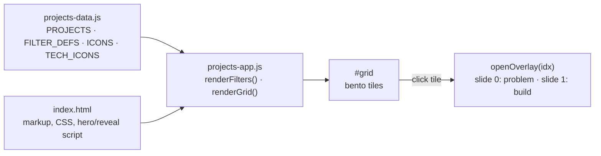

# BuiltByInstincts

The personal product portfolio of Chandru: a single static page that shows what I build, why it matters, and how each project works.

**Live:** https://chanman22git.github.io/builtbyinstincts/

## Executive summary

- **What it is:** a one-page portfolio site that presents nine projects across AI agents, AI governance, data platforms, fintech, legal tech and consumer apps.
- **Who it's for:** hiring managers, collaborators and anyone evaluating my work. Each project opens as a two-slide case study: the problem and business value first, then the build.
- **Status:** live on GitHub Pages and updated as projects ship.
- **How it's built:** plain HTML, CSS and vanilla JavaScript, with no framework and no build step. All project content lives in one data file (`projects-data.js`), so adding a project means adding one object.
- **Details:** filterable bento grid, a featured tile with a draggable phone mockup of app screenshots, keyboard-navigable case-study overlay, and links that tell apart public repos, private repos and live demos.

## Features

- **Hero and intro sequence:** a timed, staged reveal of the "BUILT BY INSTINCTS" hero. It has a fallback, so the hero still appears if the tab loads in the background and timers are throttled.
- **Projects bento grid** (`#projects`):
  - Filter chips (All, Live, In Dev, POC, AI, Open Source) with live counts. Filters that match no projects are hidden.
  - The first project, by `num`, is shown as a full-width **featured tile** when the "All" filter is active. It shows the logo, one-line pitch, three highlights, up to six stack chips, and a phone mockup that cycles through app screenshots (drag to scroll or click the dots).
  - Other tiles show status, domain, a headline impact stat and up to three stack chips.
- **Case-study overlay:** click any tile to open a two-slide overlay:
  1. **The problem:** headline, lead paragraph, business benefit and three market or impact figures.
  2. **The build:** tech stack pills with icons, an architecture flow (arrow-linked nodes) and highlights.
  Navigate with the Back and Next buttons, the dot nav, or the keyboard (`←` / `→` switch slides, `Esc` closes).
- **Link handling:** each case study shows a **Live UI** button only when a real deploy exists. A private repo shows "Private · on request" instead of a link that would 404 for visitors.
- **About and contact:** profile card with LinkedIn, a short bio, a `builder.json` terminal card, and a mailto contact section with a GitHub link.
- **Responsive:** layout breakpoints at 1080px, 860px and 720px. On small screens the phone mockup is hidden and the overlay goes full-screen.

## Projects currently listed

| # | Project | Status | Links |
|---|---------|--------|-------|
| 01 | MyPAIT: AI fitness coach (iOS and Android) | Live | Private repo |
| 02 | EvalLib: governance layer for AI agent evals | Proof of concept | [Repo](https://github.com/Chanman22git/EvalLib) |
| 03 | Penny Drop: subscription-intelligence prototype | Prototype | [Repo](https://github.com/Chanman22git/Penny-Drop) · [Live](https://chanman22git.github.io/Penny-Drop/) |
| 04 | Cost Protocol: auditable cost tracking for AI agents | Proof of concept | Private repo |
| 05 | Project Utopia: AI data-onboarding agent | In development | Private repo |
| 06 | Project Dupin: AI agents for product-discovery interviews | Proof of concept | [Repo](https://github.com/Chanman22git/Project-Dupin) |
| 07 | Pattang: workspace for solo advocates in India | In development | [Repo](https://github.com/Chanman22git/Pattang) · [Live](https://chanman22git.github.io/Pattang/) |
| 08 | Manasa Dairy: bilingual institutional B2B site | In development | [Repo](https://github.com/Chanman22git/manasa-dairy) · [Live](https://chanman22git.github.io/manasa-dairy/) |
| 09 | Invara: reproducibility proof for AI agents | Proof of concept | [Repo](https://github.com/Chanman22git/Invara) · [Live](https://chanman22git.github.io/Invara/) |

The source of truth is `projects-data.js`. This table is a snapshot of it.

## How it works



- `index.html` holds the markup, all CSS (inline `<style>`), and a small inline script for the hero intro, anchor scrolling and scroll-reveal. It loads `projects-data.js` and then `projects-app.js` at the end of `<body>`.
- `projects-data.js` defines global constants: `PROJECTS` (sorted by `num` at load), `FILTER_DEFS`, `ICONS` (GitHub and external-link SVGs), and `TECH_ICONS` (one inline SVG per stack label, with a `_fallback`).
- `projects-app.js` is a self-contained IIFE. It renders the filter chips and the grid, and fills the overlay from the selected project object.

## Tech stack

- HTML5, CSS3 (custom properties, grid, `@media` breakpoints) and vanilla JavaScript (ES2015+)
- Google Fonts: Orbitron, Rajdhani, Share Tech Mono
- Inline SVG for every icon. No image sprites and no icon library.
- Hosted on GitHub Pages. No dependencies, no bundler, no build step.

## Project structure

```
builtbyinstincts/
├── index.html          # Page markup, all styles, hero/reveal script
├── projects-data.js    # PROJECTS dataset, filter definitions, icon SVGs
├── projects-app.js     # Grid, filter and case-study overlay logic
└── assets/
    ├── mypait-logo.svg
    └── mypait/         # Screenshots for the featured phone mockup
        └── shot-0{3,4,5,7,8}.jpg
```

## Adding a project

Append an object to the `PROJECTS` array in `projects-data.js`. Display order follows `num`, not array order: the array is sorted with `a.num.localeCompare(b.num)`, so use zero-padded strings such as `'10'`. The project with the lowest `num` becomes the featured tile.

```js
{
  num: '10', name: 'My Project', acc: '#44ccff',   // acc = accent colour for tile + overlay
  domain: 'Web · AI · Something',                   // small caption under the name
  status: 'dev', statusLabel: 'IN DEVELOPMENT', statusColor: '#44ccff',
  filters: ['dev', 'ai'],                           // keys from FILTER_DEFS: live, dev, poc, ai, oss
  liner: 'One-line pitch (shown on the featured tile).',
  impact: { stat: '3×', line: 'The single number that sells it, and what it means.' },
  headline: 'Overlay slide 1 headline: the problem',
  lead: 'Problem and solution paragraph. HTML allowed, e.g. <strong>My Project</strong>.',
  benefit: 'The business value, in one or two sentences.',
  market: [                                          // three cells: big figure + caption
    { big: '$1B', cap: 'market size (cite the source)' },
    { big: '0', cap: 'manual steps' },
    { big: '2', cap: 'platforms' },
  ],
  arch: ['Input', 'Engine', 'Store', 'UI'],          // architecture flow nodes, left to right
  highlights: ['Feature one', 'Feature two', 'Feature three'],
  stack: ['React / Vite', 'Supabase'],               // labels matching TECH_ICONS keys get an icon
  repoUrl: 'https://github.com/Chanman22git/my-project',
  repoPrivate: false,                                // optional: true shows "Private · on request"
  uiUrl: 'https://chanman22git.github.io/my-project/', // optional: omit when there is no public deploy
  // optional, featured tile only:
  // logo: 'assets/my-logo.svg',
  // shots: ['assets/my/shot-01.jpg', ...],
},
```

Field notes:

- **`uiUrl`** is optional. When it is present, a **Live UI** button appears in the overlay header. Omit it rather than using a placeholder.
- **`repoPrivate: true`** replaces the **View Repo** link with a non-clickable "Private · on request" label, because private repos 404 for visitors.
- **`stack`** labels are matched exactly against `TECH_ICONS`. Add a new SVG entry there for a new tool, or the generic `_fallback` icon is used.
- **`filters`** drive the chip counts. A filter with zero matches is hidden automatically.
- **`logo` and `shots`** are only rendered on the featured tile.
- The overlay supports exactly two slides and three `market` cells are the intended layout.

## Running locally

No install is needed. Serve the folder with any static server:

```bash
git clone https://github.com/Chanman22git/builtbyinstincts.git
cd builtbyinstincts
python3 -m http.server 8000
# open http://localhost:8000
```

Opening `index.html` directly from disk also works, because it uses no modules and no fetches.

## Deployment

GitHub Pages is configured in **"Deploy from a branch"** mode: branch `main`, folder `/` (root). Every push to `main` republishes the site. The repo has no GitHub Actions workflow.

## Roadmap and known limitations

- The About section's stats ("7 Products") and the `builder.json` card list seven projects, while the grid renders nine from `projects-data.js`. These parts of `index.html` are hand-written and should be kept in sync, or generated from `PROJECTS`.
- All CSS is inline in `index.html` (about 1,500 lines). Splitting it into a stylesheet would make edits easier.
- Market figures in `projects-data.js` are attributed inline to their public sources. Refresh them as those sources update.

## Author

**Chandru** ("BuiltByInstincts"), Product & Data Builder, Bengaluru. I build products at the intersection of AI, data, and human behaviour.

- Portfolio: https://chanman22git.github.io/builtbyinstincts/
- LinkedIn: https://linkedin.com/in/chandrasekarv22
- GitHub: https://github.com/Chanman22git
